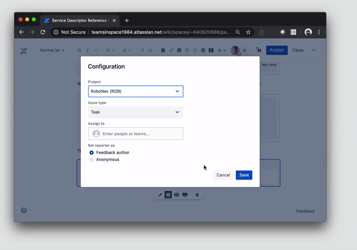
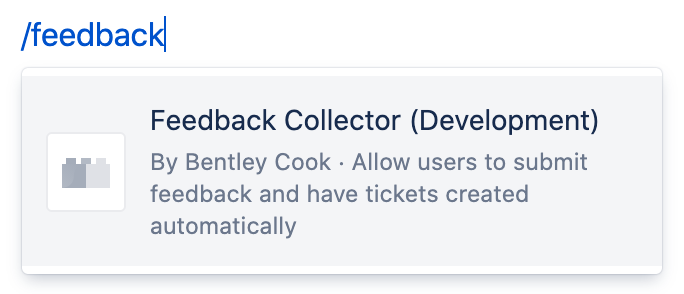
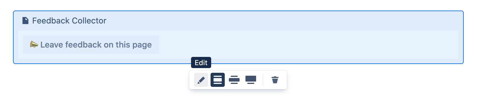

# Forge Feedback Collector Macro

This simple Forge app adds a form macro to your Confluence page that allows users to submit feedback that is converted into a Jira ticket for a project on the same site.

## Requirements

See [Set up Forge](https://developer.atlassian.com/platform/forge/set-up-forge/) for instructions to get set up.

## Quick start

Once you have logged into the CLI (`forge login`), follow the steps below to install the app onto your site:

1. Clone this repository
2. Run `forge register` to register a new copy of this app to your developer account
3. Run `npm install` to install your dependencies
4. Run `forge deploy` to deploy the app into the default environment
5. Run `forge install` and follow the prompts to install the app

_Note_: The app needs to be installed in both the Confluence instance in which it will be used and each Jira instance that it should pull projects and issues from.

After it is installed in Confluence, a new slash command option is available via `/feedback` when editing a page.

The Feedback Collector can be configured by selecting the edit option after clicking on the block titled "Feedback Collector":

## Project overview

- `index.tsx`
  Contains the main logic of the app
